# Project 1 - Digibooking

[Digibooking live demo](https://jannis-kiriasis.github.io/digibooking/)\
[Digibooking repository](https://github.com/jannis-kiriasis/digibooking)

## Table of contents
-   [Introduction](#introduction)
-	[User Experience (UX)](#user-experience-ux---user-stories)
-	[Features](#features)
-	[Where user stories meet features](#where-user-stories-meet-features)
-	[Wireframes](#wireframes)
-   [Features left to implement](#features-left-to-implement)
-	[Designs](#design)
-   [Accessibility](#accessibility)
-   [SEO](#seo)
-	[Technologies and tools used](#technologies-and-tools-used)
-	[Testing](#testing)
-	[Issues fixed](#issues-fixed)
-	[Deployment](#deployement)
-	[Credits](#credits)
-   [Acknowledgements](#acknowledgements)

## Introduction

Digibooking is a digital marketing agency offering services to hotels and B&Bs.

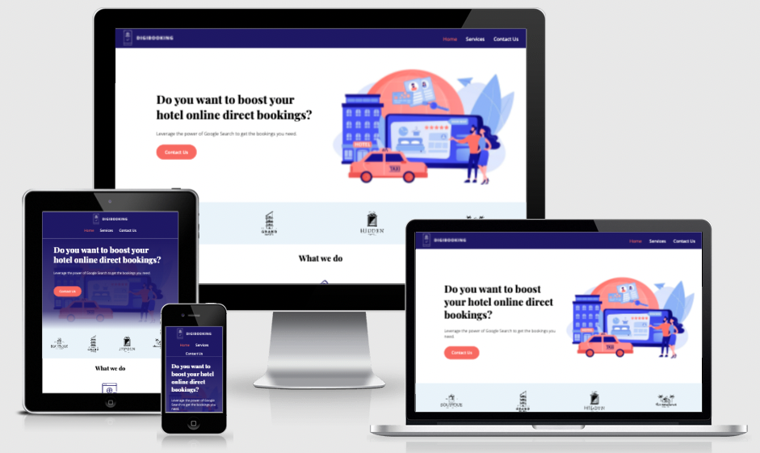

There is a good demand worldwide for hotel, B&B and rental businesses marketing. 

Just look at Google Ads keyword planner data. In the UK only there are 1k monthly searches for “hotel marketing agency”. This doesn’t include variations of the keyphrase and keywords for associated services such as “hotel SEO services” or “hotel digital marketing agency”.

Google “Hotel marketing agency” and you’ll find millions of results. Literally.

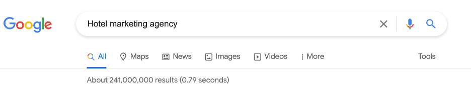

In the past, tourists used to explore and book their holidays by going to physical travel agents. 

Today, holidaymakers book online on the many Online Travel Agents (OTAs) available (booking.com, hotels.com etc).

Hotel managers had to learn how to use OTAs, generate online direct bookings and manage all the digital marketing channels to remain competitive.

Nowadays, being online isn’t enough. 

Some hotels hire entire digital marketing teams while others outsource digital marketing services from agencies.

Digibooking specialises in digital marketing services for hotels to grow their online bookings from Google Search.

### Who is Digibooking for?
Digibooking is for hotel and B&Bs managers (or those responsible for the hotels' online marketing) looking to outsource Google Search services. 

### What Digibooking offer:
- SEO: Search Engine Optimisation to grow the hotel / b&bs awareness on Google's organic results.
- PPC: Google Ads services to be on top of the search for important queries.
- Google Hotel Ads: To compete directly with the OTAs (Online travel agents) on the search.

## User Experience (UX) - user stories
Now that we are familiar with Digibooking target audience and offering, we are looking at the needs website visitors may have. Someone getting to know Digibooking is interested mainly in the services the agency offers and how to get in touch. Following, you can find the users' stories covering the main users' needs.

### First-time visitor goals
- As a first-time visitor, I want to easily understand the main purpose of the site
- As a first-time visitor, I want to be able to navigate the website easily
- As a first-time visitor, I want to understand what services Digibooking offer
- As a first-time visitor, I want to get an idea of how trusted the website (agency) is

### Returning visitor goals
- As a returning visitor, I want to get in touch with Digibooking and find out the best way to contact
- As a returning visitor, I want to know when the best time is to get in touch with Digibooking customer service or sales teams

### Frequent visitor goals
- As a frequent visitor, I want to find the agency address in case of an on-site meeting

## Features

In the following paragraphs, we are going to see what features appear on the website and where they meet the users' needs.

### Global features

This is a list of features that appear on every page.

1.	**Logo and navigation**  
    The logo and navigation menu are the same across every page of the website. This allows users to find their way through the website easily wherever they are. 

    As an industry standard, the logo links back to the homepage.

    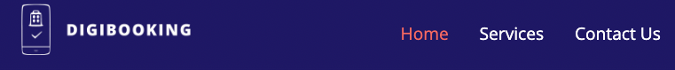

2.	**Hero image with page headline**  
    The hero image and headline block appear on index.html and services.html. It is tailored to the page content. It gives a good first idea of the page content.

    **Hero mobile**  
    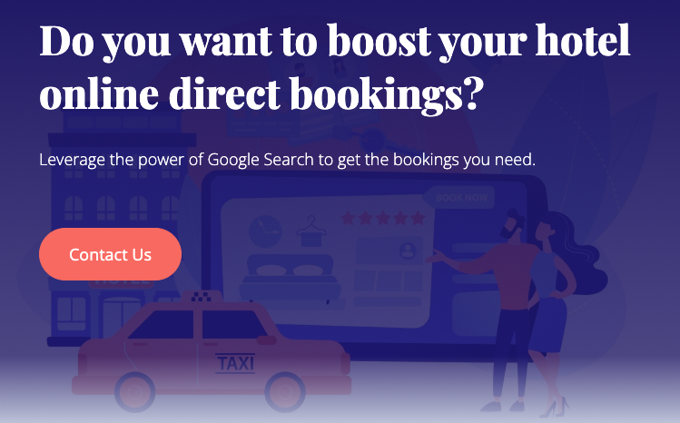

    **Hero desktop**  
    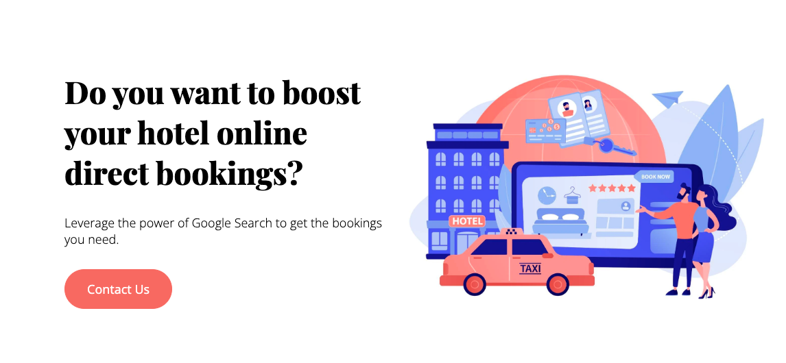

3.	**Footer**  
    The footer is also the same across every page of the website. It includes the agency's contact details, address and external links to social networks. All the external links open in new tabs.

    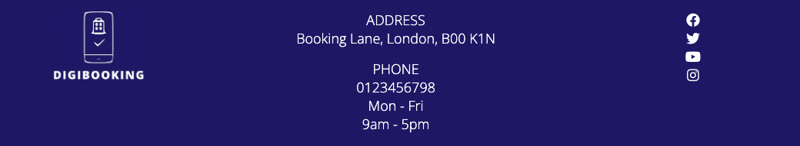

The following features are unique and appear only on the page specified.

### Homepage features - index.html

4.	**Hero image with page headline**  
    While the block used is the same appearing on services.html, its content is unique. The heading 'Do you want to boost your hotel online direct bookings?' provides the users with a very clear idea of what the website is about. The sub-line 'Leverage the power of Google Search to get the bookings you need' also specifies that the online services Digibooking provide are related to Google Search.

    The illustration recalls an online hotel room booking.

    **Hero mobile**  
    

    **Hero desktop**  
    

5.	**Top clients**  
    This feature includes 4 hotel logos, 4 clients of Digibooking. On smaller screens, the number of logos reduces to 3 for screen real estate availability reasons.

    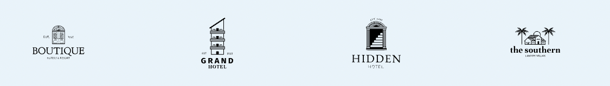

6.	**What we do**  
    This section clearly says that Digibooking services are SEO, PPC and Google Hotel Ads. Those are the 3 services offered. There is also an internal link to navigate to the services.html page which includes more information on the services provided.

    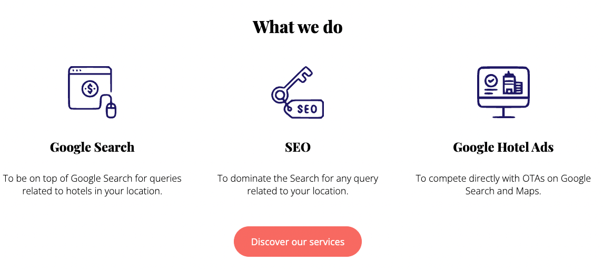

### Services features - services.html

7.	**Hero image with page headline**  
    The Headline and paragraph of this hero banner explain what services the agency offers and the approach taken. The h1 also includes keywords with high search intent.

    The illustration recalls a search for hotels and destinations on a tablet.

    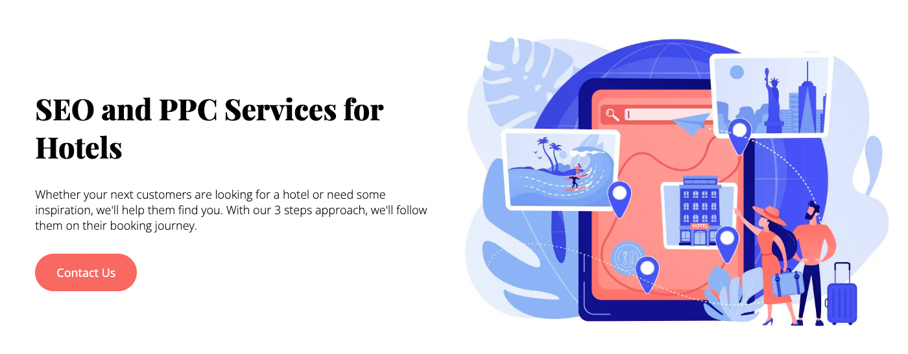

8.	**SEO services**  
    This section explains why and how Digibooking does SEO. Some holidaymakers know already where to go and so they go straight to look for a hotel. Some others like to be inspired. The second group tend to search for locations and destinations and then book a trip only when they have been inspired. This is the audience Digibooking look to target by doing SEO.

    The illustration recalls a local search on a map using a mobile or tablet.

    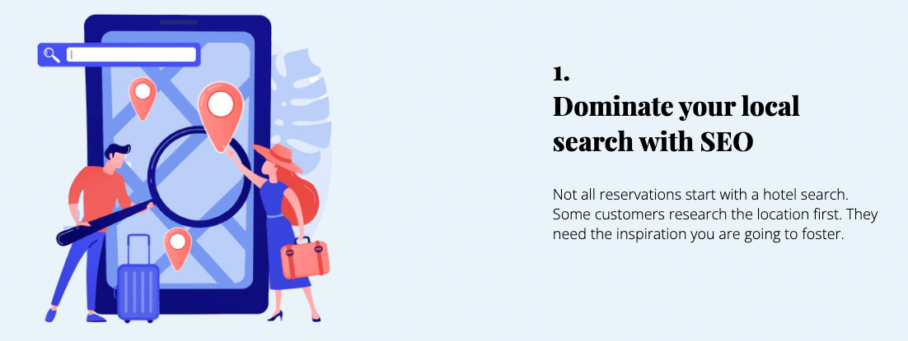

9.	**PPC services**  
    This section explains why and how Digibooking does PPC. When holidaymakers know where they want to go, they start to research different accommodation types. Google Ads helps Digibooking clients to appear on top of those search queries.

    The illustration recalls a hotel booking done on a mobile device.

    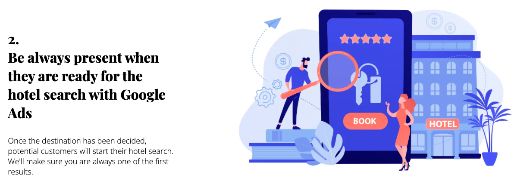

10.	**Google Hotel Ads**  
    This section explains why Digibooking offers Google Hotel Ads services. Once holidaymakers chose an accommodation type, they want to find the best price. Google Hotel Ads helps display direct prices for the accommodation selected competing directly with OTA prices since booking directly is often cheaper.

    The illustration recalls an online room booking.

    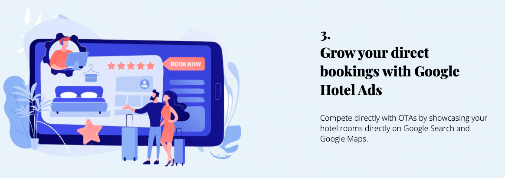

### Contact page - contact.html

11. **Contact form**  
	The contact form includes the basic personal details of the sender, the hotel or b&b website and a text area. All fields are mandatory and users can type 'none' if they don't have a website or they don't want to include a message.

    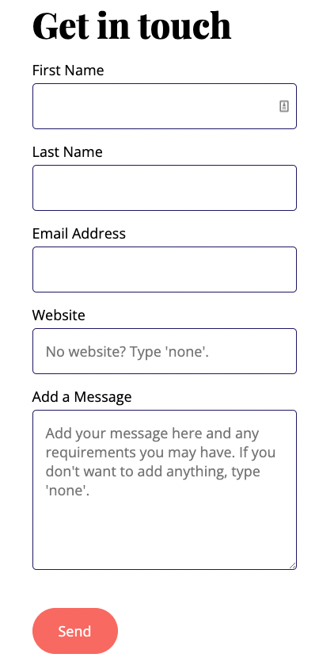

### Others
12. **Custom 404 page**  
    A custom 404 page asks visitors what page they were looking for.

    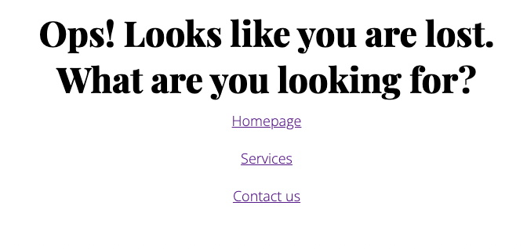

## Where user stories meet features

In the following paragraph, I’m going to match features with user needs (user stories). The features are numbered and the same feature numbers appear in the table below.

|User stories                                                                                                                       |Features                      |
|----------------------------------------------------------------------------------------------------------------------------------------|-----------------------------------|
| As a first-time visitor, I want to easily understand the main purpose of the site                                                    | 4, 6                              |
| As a first-time visitor, I want to be able to navigate the website easily                                                            | 1, plus various internal links    |
| As a first-time visitor, I want to understand what services Digibooking offer                                                    | 6, 7, 8, 9, 10                    |
| As a first-time visitor, I want to get an idea of how trusted the website (agency) is                                                | 5                                 |
| As a returning visitor, I want to get in touch with Digibooking and find out the best way to contact                             | 3, 11                             |
| As a returning visitor, I want to know when the best time is to get in touch with Digibooking customer service or sales teams    | 3                                 |
| As a frequent visitor, I want to find the agency address in case of an on-site meeting                                               | 3                                 |

## Wireframes

The first draft of the website was completed by creating wireframes using Balsamic. 

- **homepage**   
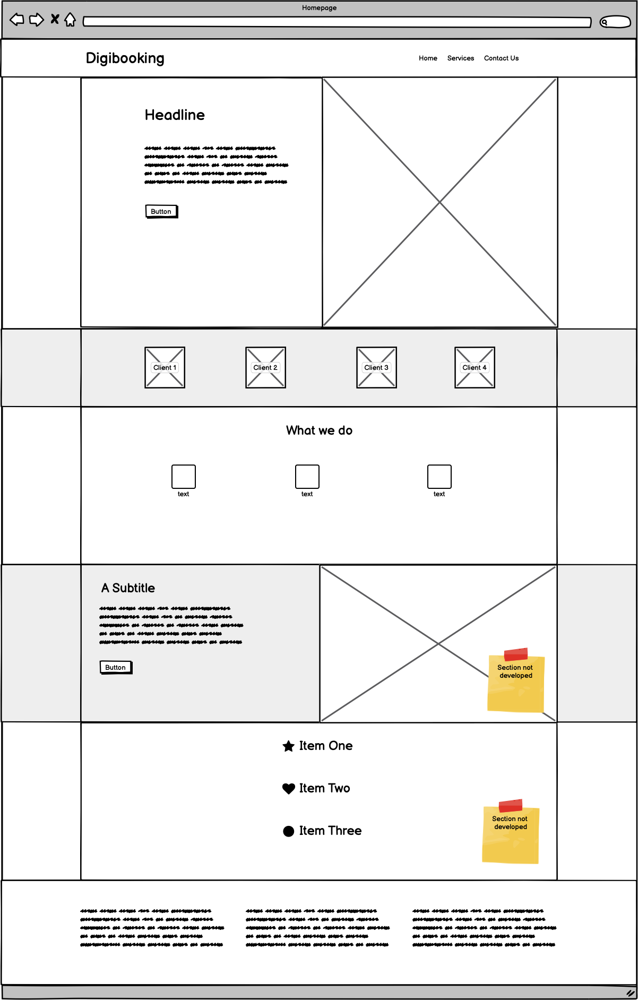

- **Services**  
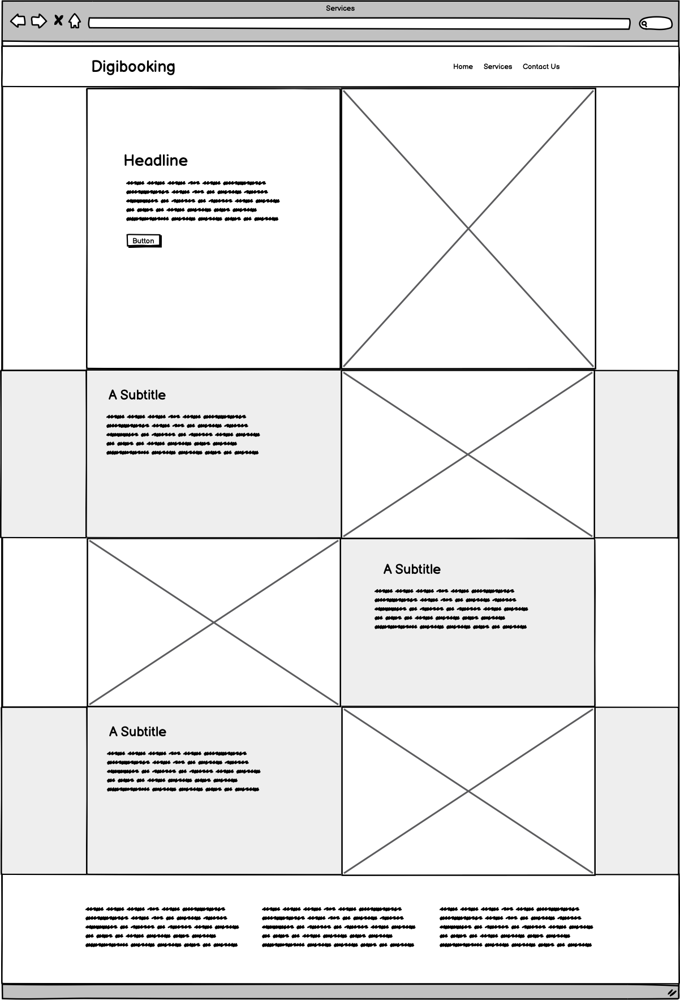

- **Contact**  
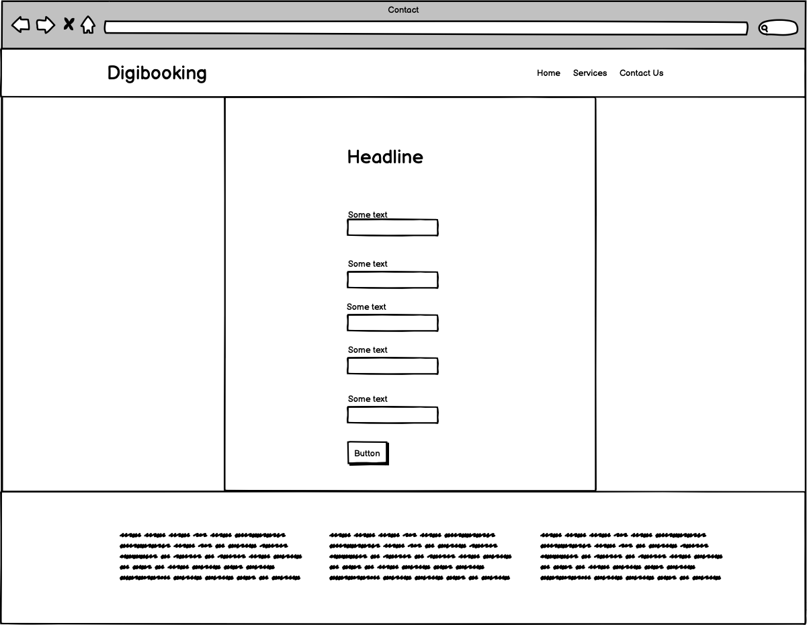

## Features left to implement 

On the first homepage draft, 2 sections (marked on the wireframe) haven't been developed. However, they would be a nice addition to future development.

- The first not developed section is an intro paragraph to a case study. That would link to a possible 4th page that explains what results have been achieved for a specific client and how. 
- The second not developed section would include recent awards won by the agency.

Both those sections address the user's needs 'As a first-time visitor, I want to get an idea of how trusted the website (agency) is'.

Other features that can be implemented in the future:
- Testimonials
- Burger dropdown mobile menu

## Design

In the following paragraph, I'm going to explain the colours, typography and imagery choices.

### Colours

The first colour I wanted to use was dark blue. Blue is a calming colour, what I had in mind was "Work with us and you won't need to worry about bookings anymore".

As I chose dark blue, I needed an opposite colour to create contrast with important elements on the page, such as the buttons. So, orange was my first choice. Then, I was able to find a set of illustrations that worked for this website and so I slightly changed the orange to a salmon/red colour to match the shades of the images.

As secondary colours, I've only used white as the background colour and for some text on dark blue background. I've also used a lighter shade of blue as a background colour to alternate sections.

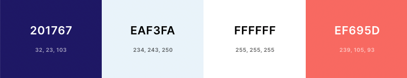

All the colours have been tested for accessibility and achieved WCAG AA at minimum.  
- [Colour contrast test: Orange on dark blue](https://webaim.org/resources/contrastchecker/?fcolor=EF695D&bcolor=201767) - Used for navigation links hover color with bold attribute.  
- [Colour contrast test: White on dark blue](https://webaim.org/resources/contrastchecker/?fcolor=FFFFFF&bcolor=201767) - Used in the header, footer and button colour hover on screens below 825px wide.  
- [Colour contrast test: White on orange](https://webaim.org/resources/contrastchecker/?fcolor=FFFFFF&bcolor=201767) - Used on buttons with bold attribute (large text).  

### Typography

The typography was chosen for my liking. Open Sans is a very popular font if not the most popular. I associate Playfair Display with a font possibly used by hotels for their headings and so I did the same.

[Playfair display](https://fonts.google.com/specimen/Playfair+Display) for headings
[Open Sans](https://fonts.google.com/specimen/Open+Sans) for body elements

The fallback fonts used are Times New Roman for headings and Helvetica for body elements.

### Imagery

I liked the idea of using illustrations. I was able to find a set of illustrations that fit perfectly. Each image used recalls the content of the section. There is a very good connection between the images and the text especially noticeable on the services page. All the illustrations come from [Freepik](https://www.freepik.com/home).

I've used Webp images where possible which is one of the lightest image formats. Nowadays, [Wepb is supported by all the major browsers](https://developers.google.com/speed/webp/faq), with [Safari being the last main browser that started supporting webp in 2020](https://caniuse.com/webp) with the release of Safari 14.

I've also used png images where I needed to have a transparent background and SVG files for icons to keep them lightweight and pixel perfect.

## Accessibility

As mentioned above, all the font colours passed a contrast test. During the testing phase, the white fonts on the orange backgrounds (only used to style buttons) resulted low in contrast ratio. One suggestion provided by [Webiam.org](https://webiam.org/) was to bold the text. Doing so gave me a minimum score of WCAG AA for the white fonts on orange background. The rest of the website (which makes the remaining 99%) achieves a score of WCAG AAA.

I've also used alt tags to describe images and aria labels to describe links and images used as background images.  
The pages have been structured using semantic HTML markup.  

I've also tested the website's accessibility on [webaccessibility.com](https://www.webaccessibility.com/).  

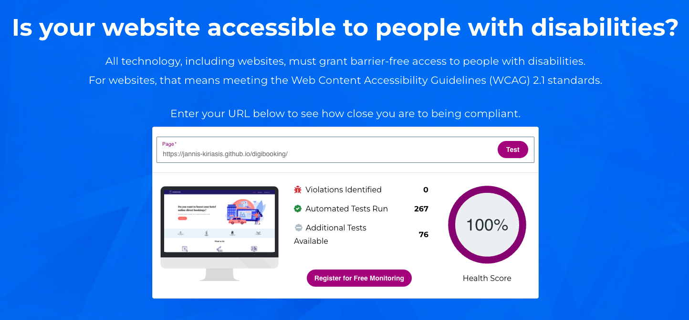

## SEO

Keywords have been used in the headings of the homepage and services page. Each page addresses a specific search intent:
- the homepage, the need for a digital marketing agency to grow online bookings
- the services page, the need for SEO and PPC services for hotels

The title tags also include target keywords and the length displays in full on Google Search. Test with this [title tag length checker](https://www.highervisibility.com/seo/tools/serp-snippet-optimizer/).

I've included the most common metadata (description, keywords, index) and a self-referring `rel=canonical` link on each page.

The lighthouse score is also optimal. A Lighthouse test is available a few paragraphs below in the testing section.

## Technologies and tools used

- [HTML5](https://en.wikipedia.org/wiki/HTML5)
- [CSS3](https://en.wikipedia.org/wiki/CSS)
- Version control: [git](https://git-scm.com/)
- Public repository: [GitHub](https://github.com/)
- Resize and edit images: [Pixlr.com](https://pixlr.com/)
- Transform png to SVG: [Convertio.co](https://convertio.co/it/png-svg/)
- Social icons: [Fontawesome](https://fontawesome.com/)
- Other icons: [Flaticon](https://www.flaticon.com/)
- Create a transparent background for illustrations: [Adobe](https://www.adobe.com/express/feature/image/)
- Create CSS gradient: [cssgradient](https://cssgradient.io/)
- Illustrations: [freepik](https://www.freepik.com)
- Google Font: [Display Playfair](https://fonts.google.com/specimen/Playfair+Display)
- Google Font: [Open Sans](https://fonts.google.com/specimen/Open+Sans)
- Wireframes: [Balsamiq](https://balsamiq.com/)

## Testing

I've carried out the following tests:

1. [HTML validation](#html-validation)
2. [CSS validation](#css-validation)
3. [Functionality testing](#functionality-testing)
4. [Browsers compatibility](#browser-compatibilty)
5. [Responsiveness testing](#responsiveness-testing)
6. [Lighthouse testing](#lighthouse-testing)
7. [User stories testing](#user-stories-testing)

### HTML validation

All the pages passed the HTML validation with no errors or warnings.
- [index.html](https://validator.w3.org/nu/?showsource=yes&showoutline=yes&showimagereport=yes&doc=https%3A%2F%2Fjannis-kiriasis.github.io%2Fdigibooking%2Findex.html)  
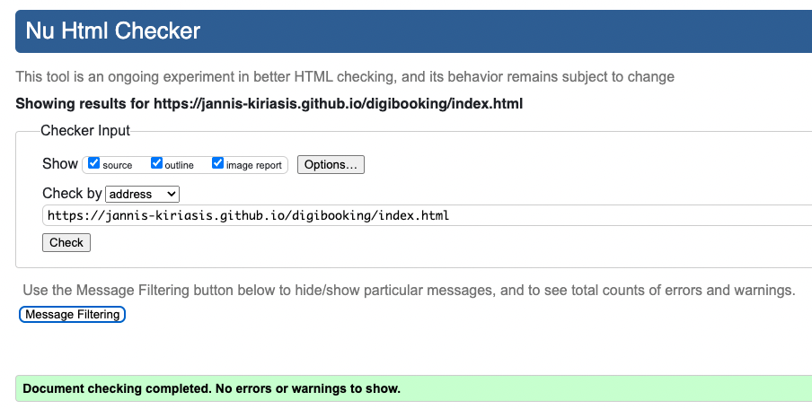
- [services.html](https://validator.w3.org/nu/?showsource=yes&showoutline=yes&showimagereport=yes&doc=https%3A%2F%2Fjannis-kiriasis.github.io%2Fdigibooking%2Fservices.html)  
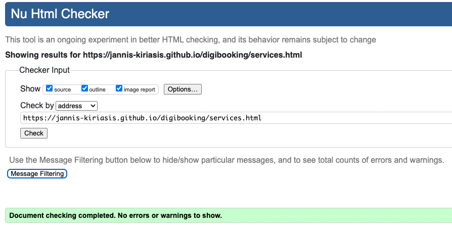
- [contact.html](https://validator.w3.org/nu/?showsource=yes&showoutline=yes&showimagereport=yes&doc=https%3A%2F%2Fjannis-kiriasis.github.io%2Fdigibooking%2Fcontact.html)  
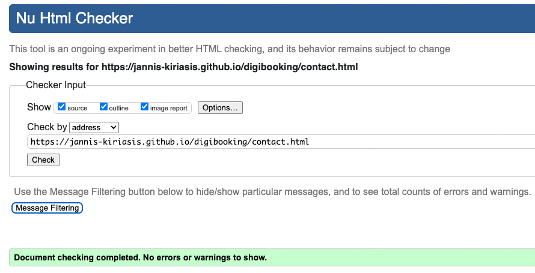

### CSS validation

Style.css passed the CSS validation with no errors or warnings.
- [css validation](https://jigsaw.w3.org/css-validator/validator?uri=https%3A%2F%2Fjannis-kiriasis.github.io%2Fdigibooking%2Findex.html&profile=css3svg&usermedium=all&warning=1&vextwarning=&lang=en)  
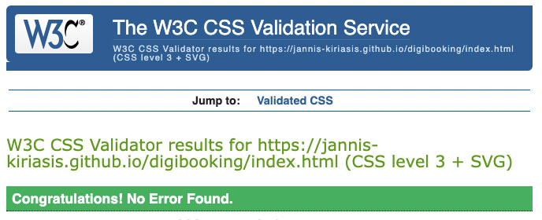

### Functionality testing

I've tested that the different aspects of the website work as intended.

|     Test Label                       |     Test Action                                                                                         |     Expected Outcome                                                              |     Test Outcome      |
|--------------------------------------|---------------------------------------------------------------------------------------------------------|-----------------------------------------------------------------------------------|-----------------------|
|     Header and   navigation links    |     Click on all header   internal links to verify they work (all pages).                               |     No links return a   404 error.                                                |     PASS all pages    |
|     Header and   navigation links    |     Click on all header   internal links to verify they link to the right pages (all pages).            |     All links should   link to the pages described in their anchor texts.         |     PASS all pages    |
|     Internal links                   |     Clink on   index.html and services.html internal links to verify they work.                         |     No links return a   404 error.                                                |     PASS all pages    |
|     Internal links                   |     Clink on   index.html and services.html internal links to verify they link to the right   pages.    |     All links should   link to the pages described in their anchor texts.         |     PASS all pages    |
|     External links                   |     Click on all   external links and verify that they (footer links).                                  |     No links return a   404 error.                                                |     PASS all pages    |
|     External links                   |     Click on all   external links and verify that they open in a new tab (footer links).                |     All external   links open in a new tab.                                       |     PASS all pages    |
|     Form completion                  |     Complete a form   and verify all fields are set to required.                                        |     The form won’t submit   if a field is missing.                                    |     PASS              |
|     Form validation                  |     Complete a form   and verify the correct field types are used (eg. Email)                           |     The form won’t submit   if the fields aren’t correctly completed.                 |     PASS              |
|     Form submission                  |     Check form submission   input names are appropriate and all fields are submitted.                   |     The input names submitted   are descriptive and no field can be left blank.    |     PASS              |
|     Interactivity                    |     Check that   navigation and internal links visually change on mouse hover.                          |     Links and buttons   change colour on mouse hover.                              |     PASS              |
|     Navigation                       |     Check that the current   page is identifiable in the navigation.                                    |     The currently   active page link is orange in navigation.                     |     PASS              |
|     404 links                       |     Clik on a non existing URL and verify it lands on the custom 404 page.                                    |      A non existing page links to the custom 404.html                    |     PASS              |

### Browser compatibility

All the functionality tests have been carried out and achieved a PASS on the latest versions of the following browsers:
- Google Chrome
- Safari
- Firefox
- Microsoft Edge

### Responsiveness testing

All the functionality tests have been carried out and achieved a PASS on the following screen resolutions:
- 365x667 (iPhone SE)
- 540x720 (Surface Duo)
- 1280x800 (Nest Hub Max)
- 2560x1600 (Macbook Pro M1)

The website has also been tested for responsiveness on [ami.responsivedesign.is](https://www.ami.responsivedesign.is/) with the following results:
- [index.html](http://ami.responsivedesign.is/?url=https://jannis-kiriasis.github.io/digibooking/index.html)
- [services.html](http://ami.responsivedesign.is/?url=https://jannis-kiriasis.github.io/digibooking/services.html)
- [contact.html](http://ami.responsivedesign.is/?url=https://jannis-kiriasis.github.io/digibooking/contact.html)

### Lighthouse testing
Overall, the lighthouse report is very positive. 

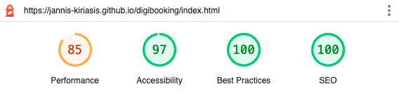  
[Lighthouse report](https://googlechrome.github.io/lighthouse/viewer/?psiurl=https%3A%2F%2Fjannis-kiriasis.github.io%2Fdigibooking%2Findex.html&strategy=mobile&category=performance&category=accessibility&category=best-practices&category=seo&category=pwa&utm_source=lh-chrome-ext)

Performance on mobile devices can be further optimised by reducing the Largest Contentful Paint and the First Contentful Paint.

- The FCP can be optimised by reducing the number of Critical Request Chains: Not using Fontawesome and Google Fonts is a solution to further improve the performance score.

- The LCP can be optimised by using a CDN to serve images (the hero images are the LCP, the largest element loading above the fold) or by removing the hero images from mobile hero banners.

Note that the performance score varies also depending on the internet connection and device used for testing.

### User stories testing

I've tested whether the user needs have been satisfied with the features created.

|     User stories                                                                                                                     |     Features                            | Result   |
|--------------------------------------------------------------------------------------------------------------------------------------|-----------------------------------------|----------|
|     As a first-time visitor, I want to easily understand the main purpose of the site                                                | 4, 6                                |     PASS |
|     As a first-time visitor, I want to be able to navigate the website easily                                                        | 1, plus   various internal links    |     PASS |
|     As a first-time visitor, I want to understand what services Digibooking offer                                                | 6, 7, 8, 9, 10                      |     PASS |
|     As a first-time visitor, I want to get an idea of how trusted the website (agency) is                                            | 5                                   |     PASS |
|     As a returning visitor, I want to get in touch with Digibooking and find out the best way to contact                             | 3, 11                               |     PASS |
|     As a returning visitor, I want to know when the best time is to get in touch with Digibooking customer service or sales teams    | 3                                      |     PASS |
|     As a frequent visitor, I want to find the agency address in case of an on-site meeting                                           | 3                                       |     PASS |

## Issues fixed

1. Fit 2 columns with width 50% and margin on the same row. The total width + margin is above 100%. Solution: use `box-sizing:border-box;` and the padding width is included in the column width [Stackoverflow](https://stackoverflow.com/questions/14416651/including-margin-for-width-and-height).
2. Make the button left and right sides completely rounded. Setting a `border-radius: 50%` will make my button completely rounder. Solution: Set the `border-radius` to the same dimension as the left and right padding.
3. Center align horizontally 4 images in a div. Solution: used `display: flex;` and `justify-content: center;` [stackoverflow](https://stackoverflow.com/questions/10989238/center-image-horizontally-within-a-div)
4. Make `search-services-white` and `search-services-light-blue` divs grow with their content. Solution: Add `overflow:hidden` to the parent container [stackoverflow](https://stackoverflow.com/questions/4657148/how-to-make-a-div-grow-with-content)

## Deployment

I've deployed the website on GitHub Pages. The website was developed on Gitpod and pushed to its GitHub repository using git command lines in the terminal. Every time a commit pushed to the website's repository updates the HTML and CSS files, GitHub Pages automatically updates the live demo.
To deploy the website:
1. from the GitHub repository, click on 'settings'
2. find and click on pages on the setting sidebar menu
3. select the branch to be used. In this case 'main'
4. Refresh the page and in a few minutes, the following message will appear if the website was deployed correctly
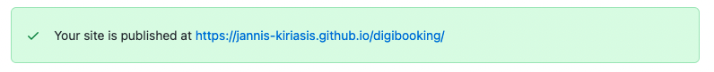

To run the website locally, use your preferred text editor and paste `git clone https://github.com/jannis-kiriasis/digibooking.git` into your terminal. To find more cloning options click on the 'code' dropdown in the [digibooking repository](https://github.com/jannis-kiriasis/digibooking/).

## Credits

### Hotel booking illustration attributions

- [Hotel booking vector created by vectorjuice - www.freepik.com](https://www.freepik.com/vectors/hotel-booking)\
- [Helpline vector created by vectorjuice - www.freepik.com](https://www.freepik.com/vectors/helpline)\
- [Hotel booking vector created by vectorjuice - www.freepik.com](https://www.freepik.com/vectors/hotel-booking)\
- [Cartoon city vector created by vectorjuice - www.freepik.com](https://www.freepik.com/vectors/cartoon-city)\
- [Mobile map vector created by vectorjuice - www.freepik.com](https://www.freepik.com/vectors/mobile-map)

### Clients logos 

- [rawpixels.com](https://www.rawpixels.com)

### Digital icons 

- [Keyword icons created by Smashicons - Flaticon](https://www.flaticon.com/free-icons/keyword)\
- [Money icons created by itim2101 - Flaticon](https://www.flaticon.com/free-icons/money")\
- [Booking icons created by Icongeek26 - Flaticon](https://www.flaticon.com/free-icons/booking)

## Acknowledgements

I previously worked in a digital marketing agency having as a client a big hotel chain. I've also helped my family business, a short term lettings business, grow online using SEO, PPC and Google Hotel Ads. Hence I came up with this website. I'm also an SEO specialist and I have been building and working on websites using Content Management Systems for the past 6 years.

Brian Macharia, my mentor, helped me test the website functionalities and provide excellent recommandations.

