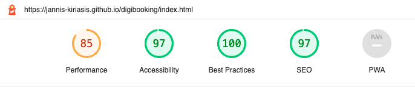

# Project 1 - Digibooking

## Introduction

[Digibooking live](https://jannis-kiriasis.github.io/digibooking/)
[Digibooking repository](https://github.com/jannis-kiriasis/digibooking)

Digibooking is a digital marketing agency offering services to hotels and B&Bs.

There is a good demand worldwide for hotel, B&B and rental businesses marketing. 

Just look at Google Ads keyword planner data. In the UK only there are 1k monthly searches for “hotel marketing agency”. This doesn’t include variation of the keyphrase and keywords for associated services such as “hotel seo services” or “hotel digital marketing agency”.

Google “Hotel marketing agency” and you’ll find million of results. Literally.

In the past, tourists used to explore and book their holidays by going to physical travel agents. 

Today, travellers book online on the many Online Travel Agents (OTAs) available (booking.com, hotels.com etc).

Hotel managers had to learn how to use OTAs, generate online direct bookings and manage all the digital marketing channels to remain competitive.

Nowadays, being online isn’t enough. 

Some hotels hire entire digital marketing teams, others, outsource digital marketing services from agencies.

Digibooking.com specialise in digital marketing services for hotels to grow their online bookings from Google Search.

[Add website screenshots]

### Who is digibooking.com for?
Digibooking.com is for hotel and B&Bs managers looking for Google Search services and a direct booking system. Hotel managers looking to create a website from scratch are also welcome.

### What digibooking.com offer:
- SEO
- PPC
- Google hotel manager
- Direct booking system with channel manager

## Table of contents
-	User Experience (UX)
-	Features
-	Where user stories meet features
-	Wireframes
-	Designs
-	Technologies Used
-	Testing
-	Known Bugs
-	Deployment
-	Acknowledgements

## User Experience (UX)
Now that we know digibooking.com offering and their target audience, we are looking at the needs website visitors may have.

## User stories
### First time visitor goals
- As a first-time visitor, I want to easily understand the main purpose of the site
- As a first-time visitor, I want to be able to navigate the website easily
- As a first-time visitor, I want to understand what services digibooking.com offer
- As a first-time visitor, I want to get an idea of how trusted the website (agency) is and what their customers say
- As a first-time visitor, I want to understand what the quality of the work delivered for existing clients is

### Returning visitor goals
- As a returning visitor, I want to get in touch with digibooking.com and find out the best way to contact
- As a returning visitor, I want to know when the best time is to get in touch with digibooking.com customer service or sales teams

### Frequent visitor goals
- As a frequent visitor, I want to find the agency address in case of an on-site meeting

## Features

### Global features
This is a list of features that appear on every page.

1.	Logo and navigation 
The logo and navigation menu is the same across every page of the website. This allows users to find their way through the website easily. 

As an industry standard, the logo links back to the homepage.

2.	Hero image with page headline
The hero image and headline block appear on every page. It is tailored to the page content. It gives a good first idea of the page content.

3.	Footer
The footer is also the same across every page of the website. It includes contact details, address and social networks external links.

### Homepage features
4.	Hero image with page headline
5.	Top clients
6.	Value proposition
7.	Awards
8.	What we do
9.	Testimonial

### Services features
10.	Hero image with page headline
11.	PPC services
12.	Seo services
13.	Google Bookings
14.	Direct bookings
15.	Testimonial

### Contact features
16.	Hero image with page headline
17.	Contact form
18.	Testimonial

## Where user stories meet features
In the following paragraph I’m going to explain what features address user needs (user stories).

|User stories                                                                                                                       |Features                      |
|----------------------------------------------------------------------------------------------------------------------------------------|-----------------------------------|
| As a first-time visitor, I want to easily understand   the main purpose of the site                                                    | 4, 6, 8                           |
| As a first-time visitor, I want to be able to   navigate the website easily                                                            | 1, plus various internal links    |
| As a first-time visitor, I want to understand what   services digibooking.com offer                                                    | 8, 10,   11, 12, 13, 14           |
| As a first-time visitor, I want to get an idea of   how trusted the website (agency) is and what their customers say                   | 5, 7, 9,   15, 18                 |
| As a first-time visitor, I want to understand what   the quality of the work delivered for existing clients is                         | 7                                 |
| As a returning visitor, I want to get in touch with   digibooking.com and find out the best way to contact                             | 3, 17                             |
| As a returning visitor, I want to know when the best   time is to get in touch with digibooking.com customer service or sales teams    | 3, 17                             |
| As a frequent visitor, I want to find the agency   address in case of an on-site meeting                                               | 3, 17                             |

## Wireframes

## Design

### Colors

All the colors used have been testes for accessibility and achieved WCAG AA at minimum.
[Color contrast test: Orange on dark blue](https://webaim.org/resources/contrastchecker/?fcolor=EF695D&bcolor=201767) - Used for navigation links hover color with bold attribute.
[Color contrast test: White on dark blue](https://webaim.org/resources/contrastchecker/?fcolor=FFFFFF&bcolor=201767) - Used in header, footer and button color hover on screens below 825px wide.
[Color contrast test: White on orange](https://webaim.org/resources/contrastchecker/?fcolor=FFFFFF&bcolor=201767) - Used on buttons with bold attribute (large text).

### Google Fonts
[Playfair display](https://fonts.google.com/specimen/Playfair+Display) for headings
[Open Sans](https://fonts.google.com/specimen/Open+Sans) for body elements
The fallback fonts used are Times New Roman for headings and Helvetica for body elements.

## Attributions

### Hotel booking illustration attributions
[Hotel booking vector created by vectorjuice - www.freepik.com](https://www.freepik.com/vectors/hotel-booking)\
[Helpline vector created by vectorjuice - www.freepik.com](https://www.freepik.com/vectors/helpline)\
[Hotel booking vector created by vectorjuice - www.freepik.com](https://www.freepik.com/vectors/hotel-booking)\
[Cartoon city vector created by vectorjuice - www.freepik.com](https://www.freepik.com/vectors/cartoon-city)\
[Mobile map vector created by vectorjuice - www.freepik.com](https://www.freepik.com/vectors/mobile-map)

### Hotel logos 

By [rawpixels.com](https://www.rawpixels.com)

### Social icons 

[Keyword icons created by Smashicons - Flaticon](https://www.flaticon.com/free-icons/keyword)\
[Money icons created by itim2101 - Flaticon](https://www.flaticon.com/free-icons/money")\
[Booking icons created by Icongeek26 - Flaticon](https://www.flaticon.com/free-icons/booking)

## Issues fixed

1. Fit 2 columns with width 50% and margin on the same row. The total width + margin is above 100%. Solution: use box-sizing:border-box and the margin width is included in the column width.
2. Make the button left and right sides completely rounded. Setting a border-radius: 50% will make my button completely rounder. Solution: Set the border-radius to the same dimension as the left and right padding.
3. Center align horizontally 4 images in a div. Solution: used display: flex and justify-content: center; [stackoverflow](https://stackoverflow.com/questions/10989238/center-image-horizontally-within-a-div)
4. Make search-services-white and search-services-light-blue grow with their content. Solution: Add overflow:hidden to parent container [stackoverflow](https://stackoverflow.com/questions/4657148/how-to-make-a-div-grow-with-content)

## Tools Used

- Resize and edit images: [Pixlr.com](https://pixlr.com/)
- Transform png to svg: [Convertio.co](https://convertio.co/it/png-svg/)
- Social icons: [Fontawesome](https://fontawesome.com/)
- Other icons: [Flaticon](https://www.flaticon.com/)
- Create transparent baackground for illustrations: [Adobe](https://www.adobe.com/express/feature/image/)
- Create CSS gradient [cssgradient](https://cssgradient.io/)

## Testing

I've carried out the folling tests:
1. [HTML validation](#html-validation)
2. [CSS validation](#css-validation)
3. [Fuctionality testing](#functionality-testing)
4. [Browsers compatibility](#browser-compatibilty)
5. [Responsiveness testing](#responsiveness-testing)
6. [Lighthouse testing](#lighthouse-testing)
7. [User stories testing](#user-stories-testing)

### HTML validation
All the pages passed the html validation with no error or warnings.
- [index.html](https://validator.w3.org/nu/?showsource=yes&showoutline=yes&showimagereport=yes&doc=https%3A%2F%2Fjannis-kiriasis.github.io%2Fdigibooking%2Findex.html)\

- [services.html](https://validator.w3.org/nu/?showsource=yes&showoutline=yes&showimagereport=yes&doc=https%3A%2F%2Fjannis-kiriasis.github.io%2Fdigibooking%2Fservices.html)\

- [contact.html](https://validator.w3.org/nu/?showsource=yes&showoutline=yes&showimagereport=yes&doc=https%3A%2F%2Fjannis-kiriasis.github.io%2Fdigibooking%2Fcontact.html)\

### CSS validation
Style.css passed the css validation with no errors or warnings.
- [css validation](https://jigsaw.w3.org/css-validator/validator?uri=https%3A%2F%2Fjannis-kiriasis.github.io%2Fdigibooking%2Findex.html&profile=css3svg&usermedium=all&warning=1&vextwarning=&lang=en)\

### Functionality testing

Test that the different aspects of the website work as intended.

|     Test Label                       |     Test Action                                                                                         |     Expected Outcome                                                              |     Test Outcome      |
|--------------------------------------|---------------------------------------------------------------------------------------------------------|-----------------------------------------------------------------------------------|-----------------------|
|     Header and   navigation links    |     Click on all header   internal links to verify they work (all pages).                               |     No links return a   404 error.                                                |     PASS all pages    |
|     Header and   navigation links    |     Click on all header   internal links to verify they link to the right pages (all pages).            |     All links should   link to the pages described in their anchor texts.         |     PASS all pages    |
|     Internal links                   |     Clink on   index.html and services.html internal links to verify they work.                         |     No links return a   404 error.                                                |     PASS all pages    |
|     Internal links                   |     Clink on   index.html and services.html internal links to verify they link to the right   pages.    |     All links should   link to the pages described in their anchor texts.         |     PASS all pages    |
|     External links                   |     Click on all   external links and verify that they (footer links).                                  |     No links return a   404 error.                                                |     PASS all pages    |
|     External links                   |     Click on all   external links and verify that they open in a new tab (footer links).                |     All external   links open in a new tab.                                       |     PASS all pages    |
|     Form completion                  |     Complete a form   and verify all fields are set to required.                                        |     Form won’t submit   if a field is missing.                                    |     PASS              |
|     Form validation                  |     Complete a form   and verify the correct field types are used (eg. Email)                           |     Form won’t submit   if the fields aren’t correctly completed.                 |     PASS              |
|     Form submission                  |     Check form submission   input names are appropriate and all fields are submitted.                   |     The input name submitted   are descriptive and no field can be left blank.    |     PASS              |
|     Interactivity                    |     Check that   navigation and internal links visually change on mouse hover.                          |     Links and buttons   change color on mouse hover.                              |     PASS              |
|     Navigation                       |     Check that the current   page is identifiable in the navigation.                                    |     The currently   active page link is orange in navigation.                     |     PASS              |

### Browser compatibilty

All the functionality tests have been carried out and achieved a PASS on the latest versions of the following browsers:
- Google Chrome
- Safari
- Firefox
- Microsoft Edge

### Responsiveness testing

All the functionality tests have been carried and achieved a PASS on the following screen resolutions:
- 365x667 (iPhone SE)
- 540x720 (Surface Duo)
- 1280x800 (Nest Hub Max)
- 2560x1600 (Macbook Pro M1)

The website has also been tested for rensiveness on ami.responsivedesign.is with the following results:
- [index.html](http://ami.responsivedesign.is/?url=https://jannis-kiriasis.github.io/digibooking/index.html)
- [services.html](http://ami.responsivedesign.is/?url=https://jannis-kiriasis.github.io/digibooking/services.html)
- [contact.html](http://ami.responsivedesign.is/?url=https://jannis-kiriasis.github.io/digibooking/contact.html)

### Lighthouse testing
Overall, the lighthouse report is very positive. 

\
[Lighthouse report](https://googlechrome.github.io/lighthouse/viewer/?psiurl=https%3A%2F%2Fjannis-kiriasis.github.io%2Fdigibooking%2Findex.html&strategy=mobile&category=performance&category=accessibility&category=best-practices&category=seo&category=pwa&utm_source=lh-chrome-ext)

Performance on mobile devices can be further optimised by reducing the Largest Contentful Paint and the First Contentful Paint.

- The FCP can be optimised by reducing the number of Critical Request Chains: Not using Fontawesome and Google Fonts is a solution to further improve the performance score.

- The LCP can be optimised by using a CDN to serve images (the hero images are the LCP) or by removing the hero images from mobile hero banners.

### User stories testing

I've tested whether the user needs have been satisfied with the features created.

|     User stories                                                                                                                     |     Features                            | Result   |
|--------------------------------------------------------------------------------------------------------------------------------------|-----------------------------------------|----------|
|     As a first-time visitor, I want to easily understand the main purpose of the site                                                | 4, 8                                |     PASS |
|     As a first-time visitor, I want to be able to navigate the website easily                                                        | 1, plus   various internal links    |     PASS |
|     As a first-time visitor, I want to understand what services digibooking.com offer                                                | 8, 10, 11, 12, 13                   |     PASS |
|     As a first-time visitor, I want to get an idea of how trusted the website (agency) is                                            | 5                                   |     PASS |
|     As a returning visitor, I want to get in touch with Digibooking and find out the best way to contact                             | 3, 17                               |     PASS |
|     As a returning visitor, I want to know when the best time is to get in touch with Digibooking customer service or sales teams    | 17                                      |     PASS |
|     As a frequent visitor, I want to find the agency address in case of an on-site meeting                                           | 3                                       |     PASS |

## Deployement

I've deployed the website on GitHub Pages. The website was developed on Gitpod and pushed to its GitHub repository usying git command lines in the terminal. Everytime a commit pushed to the website's repository updates the html and css files, GitHub Pages automatically updates the live demo.
To deploy the website:
1. from the GitHub repository, click on 'settings'
2. find and click on pages on the setting sidebar menu
3. selecte the branch to be used. In this case 'main'
4. Refresh the page and in few minutes, the following message will appear if the website was deployed correctly

To run the website locally, use your preferred text editor and paste `git clone https://github.com/jannis-kiriasis/digibooking.git` into your terminal. To find more cloning options click on the 'code' dropdown in the [digibooking repository](https://github.com/jannis-kiriasis/digibooking/).